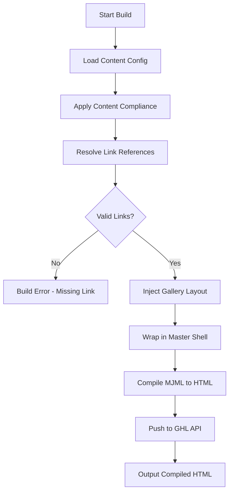

# Headless Email Factory - Cameron Estate Inn

> **Note:** This is a client-specific implementation. Each venue (Cameron Estate, Maravilla Gardens, etc.) will have its own configuration and design rules.

## Executive Summary

This document outlines the architecture for a Node.js-based "Headless Email Factory" that generates high-fidelity, brand-compliant emails for Cameron Estate Inn using MJML and pushes them to the GoHighLevel (GHL) API.

---

## Project Structure

```
clients/cameron-estate/
├── email-factory/
│   ├── package.json
│   ├── .env.example
│   ├── README.md
│   ├── templates/
│   │   ├── master-shell.mjml
│   │   ├── gallery-1-2-1.mjml
│   │   └── components/
│   │       ├── header.mjml
│   │       ├── footer.mjml
│   │       └── cta-button.mjml
│   ├── src/
│   │   ├── build.js
│   │   ├── services/
│   │   │   ├── mjml-compiler.js
│   │   │   ├── link-synchronizer.js
│   │   │   └── ghl-publisher.js
│   │   ├── models/
│   │   │   └── gallery-config.js
│   │   └── utils/
│   │       ├── content-compliance.js
│   │       └── link-replacer.js
│   ├── scripts/
│   │   └── sync-links.js
│   ├── data/
│   │   └── links.json
│   └── output/
│       └── compiled-emails/
```

---

## Component Specifications

### 1. Master Shell Template (`master_shell.mjml`)

```mjml
<mjml>
  <mj-head>
    <mj-font name="Playfair Display" href="https://fonts.googleapis.com/css2?family=Playfair+Display:wght@400;600&display=swap" />
    <mj-font name="Lato" href="https://fonts.googleapis.com/css2?family=Lato:wght@400;700&display=swap" />
    <mj-attributes>
      <mj-all font-family="Lato, sans-serif" color="#4A4A4A" font-size="16px" line-height="1.6" />
      <mj-text font-family="Lato, sans-serif" />
      <mj-heading font-family="Playfair Display, serif" color="#2C3E50" />
    </mj-attributes>
    <mj-style>
      .heading { font-family: 'Playfair Display', serif; color: #2C3E50; }
      .body-text { font-family: 'Lato', sans-serif; color: #4A4A4A; font-size: 16px; line-height: 1.6; }
    </mj-style>
  </mj-head>
  <mj-body background-color="#FAFAFA">
    <mj-section background-color="#FFFFFF" border-radius="4px">
      <mj-column>
        <!-- Content injected here -->
      </mj-column>
    </mj-section>
    <mj-section>
      <mj-column>
        <mj-divider border-color="#D4AF37" border-width="2px" />
      </mj-column>
    </mj-section>
    <mj-section>
      <mj-column>
        <mj-text align="center" font-size="14px" color="#666">
          <p style="margin: 0; font-weight: 700;">Lisa</p>
          <p style="margin: 0;">Director of Events</p>
          <p style="margin: 10px 0 0;">717-725-4831</p>
        </mj-text>
      </mj-column>
    </mj-section>
  </mj-body>
</mjml>
```

### 2. Smart Gallery Component Logic (`gallery-layouts/gallery-1-2-1.mjml`)

The gallery accepts exactly 4 images and creates a "1-2-1" narrative stack:

```mjml
<!-- IMAGE 0: Hero (Full Width) -->
<mj-image src="{{images[0]}}" width="600px" padding="0" border-radius="4px 4px 0 0" />

<!-- IMAGES 1 & 2: Options Grid (2-Column Side-by-Side) -->
<mj-section padding="10px 0">
  <mj-column>
    <mj-image src="{{images[1]}}" width="300px" height="300px" border-radius="4px" />
  </mj-column>
  <mj-column>
    <mj-image src="{{images[2]}}" width="300px" height="300px" border-radius="4px" />
  </mj-column>
</mj-section>

<!-- IMAGE 3: Closer (Full Width) -->
<mj-image src="{{images[3]}}" width="600px" padding="10px 0 0 0" border-radius="0 0 4px 4px" />
```

**Mobile Behavior:** `fluid-on-mobile="false"` keeps grids side-by-side on phones.

### 3. Content Compliance Overrides

Apply these transformations during build:

| Pattern | Replacement |
|---------|-------------|
| `"Champagne toast"` | `"Champagne toast (included in select packages)"` |
| `"Rentals & Décor"` | `"Event Inclusions"` |
| `"Bridal Suite"` | `"Two private changing spaces provided for the couple"` |

### 4. Link Synchronization (`scripts/sync-links.js`)

```javascript
// Fetches GHL trigger links and saves to data/links.json
async function syncLinks() {
  const response = await ghlService.request('GET', '/links', {
    locationId: config.locationId
  });
  
  const linkMap = {};
  for (const link of response.links) {
    linkMap[link.name] = link.id;
  }
  
  await fs.writeFile('data/links.json', JSON.stringify(linkMap, null, 2));
}
```

**Link Replacement Syntax:** `{{links.book_tour}}` → actual GHL trigger link ID

**Safety:** Throw build error if referenced link doesn't exist.

---

## Build Pipeline



---

## Email Template Examples

### Day 1: Welcome Email

```json
{
  "name": "Day 1 - Welcome",
  "subject": "Inside your Cameron Estate wedding, {{first_name}}",
  "previewText": "Your fairy tale has a home at Cameron Estate.",
  "content": {
    "heroImage": "https://cameronestateinn.com/images/hero.jpg",
    "gallery": {
      "images": [
        "https://cameronestateinn.com/images/gardens.jpg",
        "https://cameronestateinn.com/images/conservatory.jpg",
        "https://cameronestateinn.com/images/ballroom.jpg",
        "https://cameronestateinn.com/images/couple.jpg"
      ]
    },
    "body": "Hi {{first_name}}, congratulations! I imagine you're hearing from quite a few venues right now..."
  }
}
```

### Day 10: What's Included

This email uses the gallery to show ceremony/reception options:

```json
{
  "name": "Day 10 - Inclusions",
  "subject": "What 'all-inclusive' really means at Cameron Estate",
  "content": {
    "gallery": {
      "images": [
        "https://cameronestateinn.com/images/ceremony-setup.jpg",
        "https://cameronestateinn.com/images/dining.jpg",
        "https://cameronestateinn.com/images/bar-service.jpg",
        "https://cameronestateinn.com/images/reception-done.jpg"
      ]
    },
    "body": "Let me show you exactly what it means at Cameron Estate..."
  }
}
```

---

## Workflow Timing (Day 4+)

Ensure emails after Day 4 have minimum 4-day wait steps:

```json
{
  "trigger": "Day 5 Email",
  "waitStep": 5760,  // 4 days in minutes
  "actions": [
    { "type": "sendEmail", "templateId": "day5-vision" }
  ]
}
```

---

## GHL API Integration

### Email Template Push

```javascript
async function pushEmailToGHL(template) {
  const response = await ghlService.request('POST', '/emails/builder', {
    locationId: config.locationId,
    name: template.name,
    subject: template.subject,
    body: compiledHtml,
    type: 'html'
  });
  
  return response.id; // GHL template ID
}
```

### Link Creation (Optional)

```javascript
async function createTriggerLink(name, triggerId) {
  return await ghlService.request('POST', '/links', {
    locationId: config.locationId,
    name: name,
    triggerId: triggerId
  });
}
```

---

## Environment Variables

```bash
GHL_API_KEY=your_pit_token
GHL_LOCATION_ID=your_location_id
MJML_API_KEY=optional_mjml_cloud_key
```

---

## Next Steps

1. Create `apps/email-factory/` directory structure
2. Implement MJML templates with gallery layouts
3. Build the build script with compliance overrides
4. Create link synchronization script
5. Integrate GHL API publisher
6. Add workflow timing logic
7. Test with Cameron Estate content
