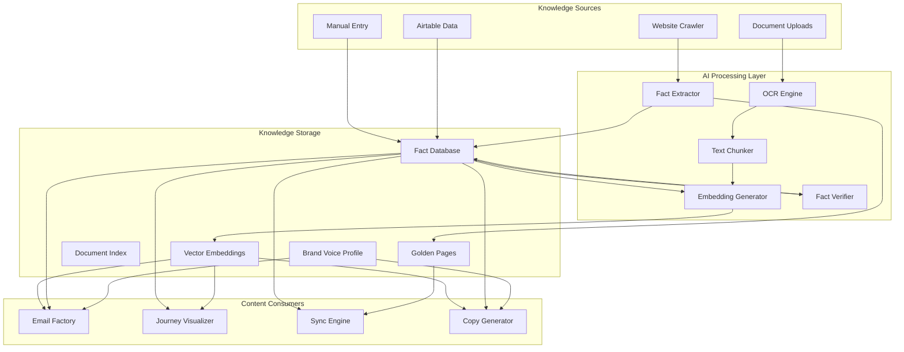
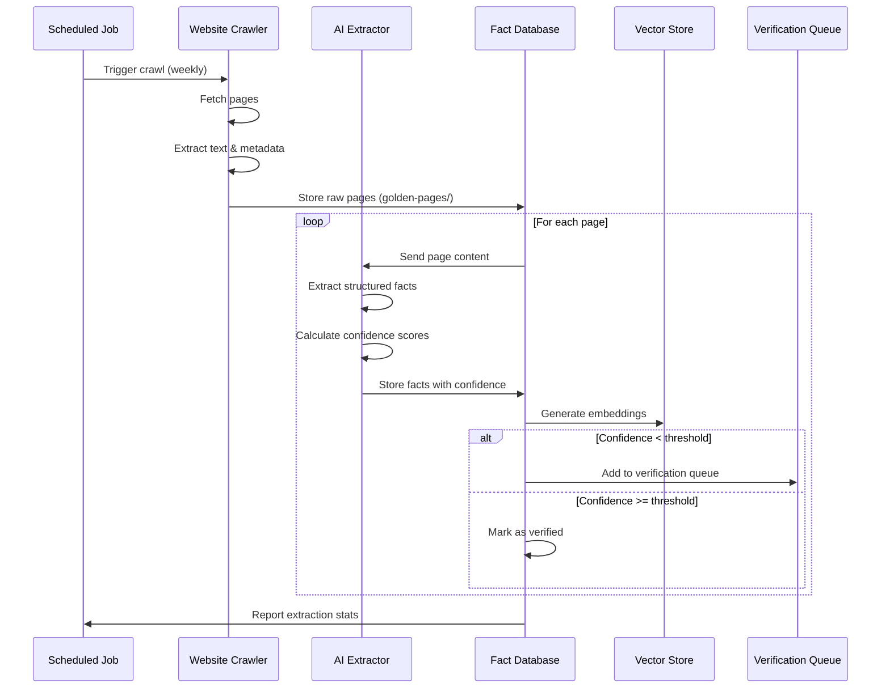
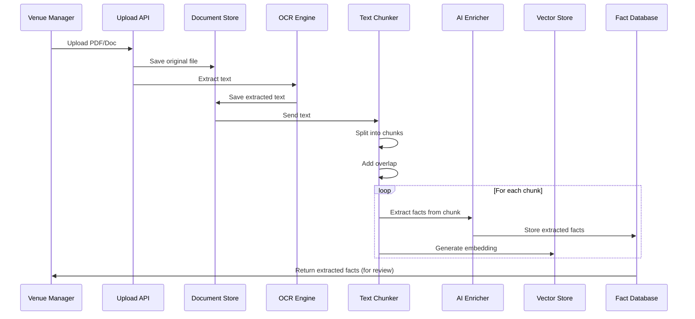
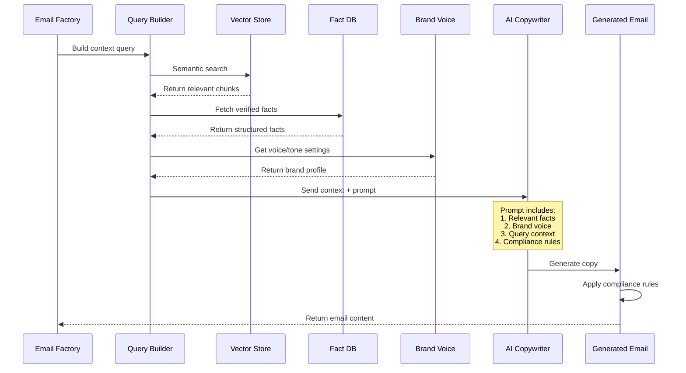
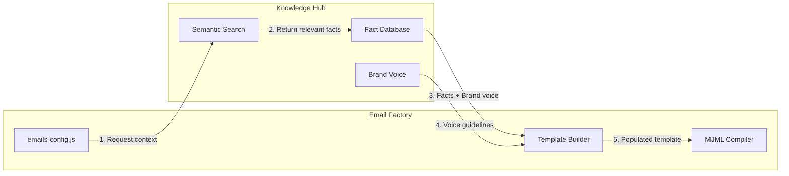
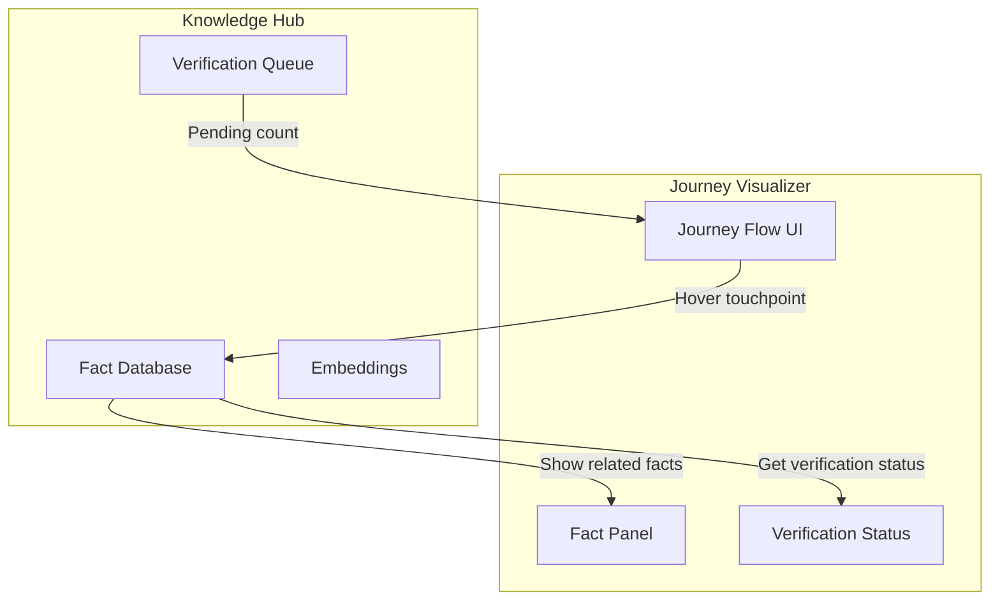
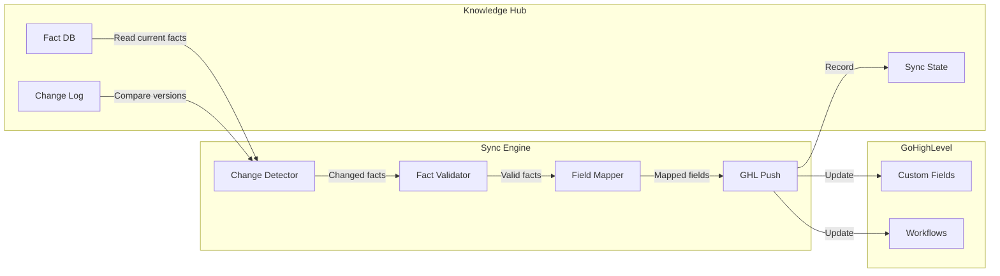

# Knowledge Hub Architecture for BloomBuilder

## Executive Summary

The **Knowledge Hub** is a centralized, intelligent data layer that serves as the single source of truth for all client-specific facts, content, and context. It transforms BloomBuilder from a template-based system into an AI-powered, context-aware platform that generates highly personalized, accurate content for wedding venue marketing.

---

## 1. Directory Structure

```
clients/{client}/
├── knowledge-hub/                    # NEW: Central knowledge repository
│   ├── README.md                     # Knowledge Hub documentation
│   ├── config.json                   # Hub configuration & settings
│   │
│   ├── golden-pages/                 # Important website URLs with metadata
│   │   ├── index.json                # Registry of all golden pages
│   │   ├── homepage.json             # Homepage facts & metadata
│   │   ├── pricing.json              # Pricing page facts
│   │   ├── venue-spaces.json         # Venue/space descriptions
│   │   ├── accommodations.json       # Lodging information
│   │   └── faq.json                  # FAQ page facts
│   │
│   ├── documents/                    # Uploaded files (PDFs, docs, images)
│   │   ├── index.json                # Document registry with metadata
│   │   ├── uploads/                  # Original uploaded files
│   │   │   ├── venue-guide-2026.pdf
│   │   │   ├── wedding-packet.docx
│   │   │   └── floor-plan.jpg
│   │   ├── extracted/                # OCR text extracts
│   │   │   ├── venue-guide-2026.txt
│   │   │   └── wedding-packet.txt
│   │   └── chunks/                   # Semantic chunks for embedding
│   │       ├── venue-guide-2026/
│   │       │   ├── chunk-001.json
│   │       │   └── chunk-002.json
│   │       └── wedding-packet/
│   │           └── chunk-001.json
│   │
│   ├── facts/                        # Structured fact database
│   │   ├── index.json                # Fact registry & categories
│   │   ├── pricing/                  # Pricing-related facts
│   │   │   ├── base-packages.json
│   │   │   ├── add-ons.json
│   │   │   └── payment-terms.json
│   │   ├── capacity/                 # Capacity & space facts
│   │   │   ├── ceremony-spaces.json
│   │   │   ├── reception-venues.json
│   │   │   └── guest-accommodations.json
│   │   ├── policies/                 # Policies & rules
│   │   │   ├── cancellation.json
│   │   │   ├── vendor-policy.json
│   │   │   └── restrictions.json
│   │   ├── amenities/                # Features & amenities
│   │   │   ├── included-services.json
│   │   │   ├── equipment.json
│   │   │   └── staff-services.json
│   │   └── venue-details/            # Physical venue info
│   │       ├── location.json
│   │       ├── history.json
│   │       └── architecture.json
│   │
│   ├── brand-voice/                  # Brand voice profile
│   │   ├── profile.json              # Complete brand voice definition
│   │   ├── vocabulary.json           # Approved terminology
│   │   ├── tone-analysis.json        # Tone patterns & examples
│   │   ├── examples/                 # Writing examples by category
│   │   │   ├── welcoming.json
│   │   │   ├── informative.json
│   │   │   ├── persuasive.json
│   │   │   └── urgent.json
│   │   └── prohibited/               # Terms/phrases to avoid
│   │       └── terms.json
│   │
│   ├── embeddings/                   # Vector embeddings for semantic search
│   │   ├── index.json                # Embedding registry
│   │   ├── facts/                    # Fact embeddings
│   │   │   └── vectors.json
│   │   ├── documents/                # Document chunk embeddings
│   │   │   └── vectors.json
│   │   └── pages/                    # Golden page embeddings
│   │       └── vectors.json
│   │
│   ├── verification/                 # Fact verification status
│   │   ├── queue.json                # Pending verifications
│   │   ├── log.json                  # Verification history
│   │   └── confidence-report.json    # AI confidence scores
│   │
│   └── sync-state/                   # Sync tracking
│       ├── last-crawl.json           # Website crawl timestamp
│       ├── last-extraction.json      # AI extraction timestamp
│       └── changes.json              # Change log
│
└── ... (existing client files)
```

---

## 2. JSON Schemas

### 2.1 Golden Pages Schema (`golden-pages/index.json`)

```json
{
  "$schema": "http://json-schema.org/draft-07/schema#",
  "type": "object",
  "title": "Golden Pages Index",
  "description": "Registry of important website URLs with metadata and extracted facts",
  "properties": {
    "version": { "type": "string", "default": "1.0.0" },
    "lastUpdated": { "type": "string", "format": "date-time" },
    "pages": {
      "type": "array",
      "items": {
        "type": "object",
        "required": ["id", "url", "title", "importance"],
        "properties": {
          "id": { "type": "string", "description": "Unique page identifier" },
          "url": { "type": "string", "format": "uri" },
          "title": { "type": "string" },
          "description": { "type": "string" },
          "importance": {
            "type": "string",
            "enum": ["critical", "high", "medium", "low"],
            "description": "Business importance of this page"
          },
          "category": {
            "type": "string",
            "enum": ["pricing", "venue", "accommodations", "policies", "about", "contact", "gallery", "blog"]
          },
          "lastCrawled": { "type": "string", "format": "date-time" },
          "contentHash": { "type": "string", "description": "MD5 hash of content for change detection" },
          "extractedFacts": {
            "type": "array",
            "items": { "type": "string", "description": "Fact IDs extracted from this page" }
          },
          "embeddingId": { "type": "string", "description": "Reference to vector embedding" }
        }
      }
    }
  }
}
```

**Example:**

```json
{
  "version": "1.0.0",
  "lastUpdated": "2026-02-21T16:00:00Z",
  "pages": [
    {
      "id": "homepage",
      "url": "https://www.maisonalbion.com",
      "title": "Maison Albion | Historic Wedding Venue in Western NY",
      "description": "Historic 1878 Victorian mansion wedding venue serving Buffalo, Rochester & Western NY",
      "importance": "critical",
      "category": "about",
      "lastCrawled": "2026-02-21T10:00:00Z",
      "contentHash": "a1b2c3d4e5f6",
      "extractedFacts": ["fact-001", "fact-002", "fact-003"],
      "embeddingId": "emb-page-001"
    },
    {
      "id": "pricing",
      "url": "https://www.maisonalbion.com/wedding-venue-investment",
      "title": "Wedding Pricing & Packages | Starting at $5,000",
      "description": "Complete pricing for all celebration styles",
      "importance": "critical",
      "category": "pricing",
      "lastCrawled": "2026-02-21T10:05:00Z",
      "contentHash": "b2c3d4e5f6g7",
      "extractedFacts": ["fact-010", "fact-011", "fact-012"],
      "embeddingId": "emb-page-002"
    }
  ]
}
```

---

### 2.2 Document Index Schema (`documents/index.json`)

```json
{
  "$schema": "http://json-schema.org/draft-07/schema#",
  "type": "object",
  "title": "Document Index",
  "description": "Registry of uploaded files with OCR text, metadata, and embedding IDs",
  "properties": {
    "version": { "type": "string" },
    "lastUpdated": { "type": "string", "format": "date-time" },
    "documents": {
      "type": "array",
      "items": {
        "type": "object",
        "required": ["id", "filename", "type", "uploadedAt"],
        "properties": {
          "id": { "type": "string" },
          "filename": { "type": "string" },
          "originalName": { "type": "string" },
          "type": {
            "type": "string",
            "enum": ["pdf", "docx", "doc", "txt", "jpg", "jpeg", "png", "tiff"]
          },
          "category": {
            "type": "string",
            "enum": ["pricing", "contract", "menu", "floor-plan", "brochure", "policy", "other"]
          },
          "uploadedAt": { "type": "string", "format": "date-time" },
          "uploadedBy": { "type": "string" },
          "fileSize": { "type": "integer", "description": "Size in bytes" },
          "pages": { "type": "integer", "description": "Number of pages (for PDFs/docs)" },
          "ocrStatus": {
            "type": "string",
            "enum": ["pending", "processing", "completed", "failed"]
          },
          "ocrTextPath": { "type": "string", "description": "Path to extracted text file" },
          "wordCount": { "type": "integer" },
          "chunkCount": { "type": "integer" },
          "embeddingIds": {
            "type": "array",
            "items": { "type": "string" }
          },
          "extractedFacts": {
            "type": "array",
            "items": { "type": "string" }
          },
          "tags": {
            "type": "array",
            "items": { "type": "string" }
          }
        }
      }
    }
  }
}
```

**Example:**

```json
{
  "version": "1.0.0",
  "lastUpdated": "2026-02-21T16:00:00Z",
  "documents": [
    {
      "id": "doc-001",
      "filename": "venue-guide-2026.pdf",
      "originalName": "Maison Albion Venue Guide 2026.pdf",
      "type": "pdf",
      "category": "pricing",
      "uploadedAt": "2026-02-20T14:30:00Z",
      "uploadedBy": "sarah@venue.com",
      "fileSize": 2456789,
      "pages": 12,
      "ocrStatus": "completed",
      "ocrTextPath": "documents/extracted/venue-guide-2026.txt",
      "wordCount": 3450,
      "chunkCount": 15,
      "embeddingIds": ["emb-doc-001-001", "emb-doc-001-002"],
      "extractedFacts": ["fact-020", "fact-021", "fact-022"],
      "tags": ["pricing", "packages", "2026"]
    }
  ]
}
```

---

### 2.3 Fact Database Schema (`facts/index.json`)

```json
{
  "$schema": "http://json-schema.org/draft-07/schema#",
  "type": "object",
  "title": "Fact Database Index",
  "description": "Structured facts with sources, confidence scores, and verification status",
  "properties": {
    "version": { "type": "string" },
    "lastUpdated": { "type": "string", "format": "date-time" },
    "factCount": { "type": "integer" },
    "verifiedCount": { "type": "integer" },
    "categories": {
      "type": "array",
      "items": {
        "type": "object",
        "properties": {
          "id": { "type": "string" },
          "name": { "type": "string" },
          "description": { "type": "string" },
          "factCount": { "type": "integer" }
        }
      }
    },
    "facts": {
      "type": "array",
      "items": {
        "type": "object",
        "required": ["id", "category", "type", "statement", "source", "confidence", "verificationStatus"],
        "properties": {
          "id": { "type": "string" },
          "category": {
            "type": "string",
            "enum": ["pricing", "capacity", "policies", "amenities", "venue-details", "contact"]
          },
          "subcategory": { "type": "string" },
          "type": {
            "type": "string",
            "enum": ["scalar", "range", "list", "boolean", "text"]
          },
          "statement": { "type": "string", "description": "The fact in natural language" },
          "value": {},
          "unit": { "type": "string", "description": "Unit of measurement (price, count, etc.)" },
          "validFrom": { "type": "string", "format": "date" },
          "validUntil": { "type": "string", "format": "date" },
          "source": {
            "type": "object",
            "properties": {
              "type": { "type": "string", "enum": ["website", "document", "manual-entry", "api"] },
              "reference": { "type": "string", "description": "ID of source (page ID, doc ID, etc.)" },
              "url": { "type": "string" },
              "extractedAt": { "type": "string", "format": "date-time" }
            }
          },
          "confidence": {
            "type": "number",
            "minimum": 0,
            "maximum": 1,
            "description": "AI confidence score"
          },
          "verificationStatus": {
            "type": "string",
            "enum": ["ai-extracted", "pending-review", "verified", "disputed", "deprecated"]
          },
          "verifiedBy": { "type": "string" },
          "verifiedAt": { "type": "string", "format": "date-time" },
          "verificationNotes": { "type": "string" },
          "tags": {
            "type": "array",
            "items": { "type": "string" }
          },
          "embeddingId": { "type": "string" },
          "usedIn": {
            "type": "array",
            "items": { "type": "string", "description": "IDs of content using this fact" }
          }
        }
      }
    }
  }
}
```

**Example:**

```json
{
  "version": "1.0.0",
  "lastUpdated": "2026-02-21T16:00:00Z",
  "factCount": 47,
  "verifiedCount": 32,
  "categories": [
    { "id": "pricing", "name": "Pricing", "description": "All pricing-related facts", "factCount": 15 },
    { "id": "capacity", "name": "Capacity", "description": "Guest capacity information", "factCount": 8 }
  ],
  "facts": [
    {
      "id": "fact-001",
      "category": "pricing",
      "subcategory": "base-packages",
      "type": "range",
      "statement": "Wedding packages start at $5,000",
      "value": { "min": 5000, "max": null },
      "unit": "USD",
      "validFrom": "2026-01-01",
      "source": {
        "type": "website",
        "reference": "homepage",
        "url": "https://www.maisonalbion.com",
        "extractedAt": "2026-02-21T10:00:00Z"
      },
      "confidence": 0.95,
      "verificationStatus": "verified",
      "verifiedBy": "sarah@venue.com",
      "verifiedAt": "2026-02-21T12:00:00Z",
      "tags": ["pricing", "packages", "minimum"],
      "embeddingId": "emb-fact-001",
      "usedIn": ["email-001", "email-002"]
    },
    {
      "id": "fact-002",
      "category": "capacity",
      "subcategory": "reception-venues",
      "type": "scalar",
      "statement": "Ballroom can accommodate 299 guests for ceremony, 250 seated at round tables",
      "value": 299,
      "unit": "guests",
      "validFrom": "2026-01-01",
      "source": {
        "type": "website",
        "reference": "venue-spaces",
        "url": "https://www.maisonalbion.com/wedding-venue",
        "extractedAt": "2026-02-21T10:00:00Z"
      },
      "confidence": 0.92,
      "verificationStatus": "ai-extracted",
      "tags": ["capacity", "ballroom", "reception"],
      "embeddingId": "emb-fact-002",
      "usedIn": []
    }
  ]
}
```

---

### 2.4 Brand Voice Profile Schema (`brand-voice/profile.json`)

```json
{
  "$schema": "http://json-schema.org/draft-07/schema#",
  "type": "object",
  "title": "Brand Voice Profile",
  "description": "Complete brand voice definition including tone, vocabulary, and writing patterns",
  "properties": {
    "version": { "type": "string" },
    "lastUpdated": { "type": "string", "format": "date-time" },
    "companyName": { "type": "string" },
    "website": { "type": "string", "format": "uri" },
    "logoUrl": { "type": "string" },
    "voice": {
      "type": "object",
      "properties": {
        "adjectives": {
          "type": "array",
          "items": { "type": "string" },
          "description": "3-5 adjectives describing the brand voice"
        },
        "personality": {
          "type": "string",
          "description": "Human personality archetype (e.g., 'helpful friend', 'elegant host')"
        },
        "do": {
          "type": "array",
          "items": { "type": "string" },
          "description": "Writing guidelines to follow"
        },
        "dont": {
          "type": "array",
          "items": { "type": "string" },
          "description": "Writing guidelines to avoid"
        }
      }
    },
    "vocabulary": {
      "type": "object",
      "properties": {
        "preferred": {
          "type": "array",
          "items": {
            "type": "object",
            "properties": {
              "term": { "type": "string" },
              "context": { "type": "string" },
              "insteadOf": { "type": "string" }
            }
          }
        },
        "prohibited": {
          "type": "array",
          "items": {
            "type": "object",
            "properties": {
              "term": { "type": "string" },
              "reason": { "type": "string" },
              "alternative": { "type": "string" }
            }
          }
        },
        "industry": {
          "type": "array",
          "items": { "type": "string" },
          "description": "Industry-specific terms to use"
        }
      }
    },
    "tone": {
      "type": "object",
      "properties": {
        "byStage": {
          "type": "array",
          "items": {
            "type": "object",
            "properties": {
              "stage": { "type": "string", "enum": ["welcome", "nurture", "consideration", "decision", "close"] },
              "tone": { "type": "string" },
              "formality": { "type": "number", "minimum": 0, "maximum": 1 },
              "enthusiasm": { "type": "number", "minimum": 0, "maximum": 1 },
              "urgency": { "type": "number", "minimum": 0, "maximum": 1 }
            }
          }
        },
        "patterns": {
          "type": "array",
          "items": {
            "type": "object",
            "properties": {
              "name": { "type": "string" },
              "description": { "type": "string" },
              "examples": { "type": "array", "items": { "type": "string" } }
            }
          }
        }
      }
    },
    "visual": {
      "type": "object",
      "properties": {
        "primaryColors": { "type": "array", "items": { "type": "string" } },
        "secondaryColors": { "type": "array", "items": { "type": "string" } },
        "typography": {
          "type": "object",
          "properties": {
            "headingFont": { "type": "string" },
            "bodyFont": { "type": "string" },
            "accentFont": { "type": "string" }
          }
        },
        "imageryStyle": { "type": "string" }
      }
    },
    "examples": {
      "type": "object",
      "properties": {
        "emails": {
          "type": "array",
          "items": {
            "type": "object",
            "properties": {
              "category": { "type": "string" },
              "subject": { "type": "string" },
              "snippet": { "type": "string" }
            }
          }
        }
      }
    }
  }
}
```

**Example:**

```json
{
  "version": "1.0.0",
  "lastUpdated": "2026-02-21T16:00:00Z",
  "companyName": "Maison Albion",
  "website": "https://www.maisonalbion.com",
  "logoUrl": "https://msgsndr-private.storage.googleapis.com/locationPhotos/5ef1fcf4-5da1-40d2-9070-0c0168bc3d79.png",
  "voice": {
    "adjectives": ["warm", "elegant", "approachable", "knowledgeable", "romantic"],
    "personality": "An elegant but approachable host who genuinely loves celebrations",
    "do": [
      "Use warm, inviting language",
      "Refer to the venue as 'we' and 'our team'",
      "Include specific details and numbers",
      "Address the couple by first name",
      "Share genuine enthusiasm"
    ],
    "dont": [
      "Use pushy sales language",
      "Be overly formal or stuffy",
      "Make promises that can't be kept",
      "Use generic wedding industry buzzwords"
    ]
  },
  "vocabulary": {
    "preferred": [
      { "term": "celebration", "context": "Instead of 'event'", "insteadOf": "event" },
      { "term": "guests", "context": "Instead of 'attendees'", "insteadOf": "attendees" },
      { "term": "couple", "context": "Instead of 'client'", "insteadOf": "client" }
    ],
    "prohibited": [
      { "term": "cheap", "reason": "Implies low quality", "alternative": "affordable" },
      { "term": "unlimited alcohol", "reason": "Legal compliance", "alternative": "premium open bar" }
    ],
    "industry": ["venue", "ceremony", "reception", "catering", "coordinator"]
  },
  "tone": {
    "byStage": [
      { "stage": "welcome", "tone": "warm and personal", "formality": 0.3, "enthusiasm": 0.8, "urgency": 0.1 },
      { "stage": "nurture", "tone": "helpful and educational", "formality": 0.4, "enthusiasm": 0.6, "urgency": 0.2 },
      { "stage": "consideration", "tone": "confident and transparent", "formality": 0.5, "enthusiasm": 0.7, "urgency": 0.4 },
      { "stage": "decision", "tone": "encouraging but respectful", "formality": 0.5, "enthusiasm": 0.7, "urgency": 0.6 },
      { "stage": "close", "tone": "gracious and supportive", "formality": 0.4, "enthusiasm": 0.5, "urgency": 0.2 }
    ],
    "patterns": [
      {
        "name": "Rhetorical Questions",
        "description": "Engage the reader with thoughtful questions",
        "examples": ["Can you see yourself walking down the aisle?"]
      }
    ]
  },
  "visual": {
    "primaryColors": ["#2C3E50", "#D4AF37", "#FDFCFA"],
    "secondaryColors": ["#F5F1EB", "#8B7355"],
    "typography": {
      "headingFont": "Cormorant Garamond",
      "bodyFont": "Poppins",
      "accentFont": "Cormorant Garamond"
    },
    "imageryStyle": "Elegant, natural light photography with warm tones"
  }
}
```

---

### 2.5 Embeddings Index Schema (`embeddings/index.json`)

```json
{
  "$schema": "http://json-schema.org/draft-07/schema#",
  "type": "object",
  "title": "Embeddings Index",
  "description": "Registry of vector embeddings for semantic search",
  "properties": {
    "version": { "type": "string" },
    "model": {
      "type": "object",
      "properties": {
        "name": { "type": "string" },
        "provider": { "type": "string" },
        "dimensions": { "type": "integer" },
        "version": { "type": "string" }
      }
    },
    "lastUpdated": { "type": "string", "format": "date-time" },
    "totalEmbeddings": { "type": "integer" },
    "vectors": {
      "type": "array",
      "items": {
        "type": "object",
        "required": ["id", "type", "sourceId", "text", "embedding"],
        "properties": {
          "id": { "type": "string" },
          "type": {
            "type": "string",
            "enum": ["fact", "document-chunk", "page", "query-history"]
          },
          "sourceId": { "type": "string", "description": "ID of the source fact/doc/page" },
          "text": { "type": "string", "description": "The text that was embedded" },
          "embedding": {
            "type": "array",
            "items": { "type": "number" },
            "description": "Vector embedding array"
          },
          "metadata": {
            "type": "object",
            "properties": {
              "category": { "type": "string" },
              "tags": { "type": "array", "items": { "type": "string" } },
              "createdAt": { "type": "string", "format": "date-time" }
            }
          }
        }
      }
    }
  }
}
```

---

### 2.6 Knowledge Hub Config Schema (`config.json`)

```json
{
  "$schema": "http://json-schema.org/draft-07/schema#",
  "type": "object",
  "title": "Knowledge Hub Configuration",
  "description": "Configuration and settings for the Knowledge Hub",
  "properties": {
    "version": { "type": "string" },
    "enabled": { "type": "boolean" },
    "clientId": { "type": "string" },
    "settings": {
      "type": "object",
      "properties": {
        "autoExtract": { "type": "boolean", "description": "Auto-extract facts from crawled pages" },
        "verifyThreshold": { "type": "number", "description": "Confidence threshold for auto-verification" },
        "crawlFrequency": { "type": "string", "enum": ["daily", "weekly", "monthly", "manual"] },
        "embeddingModel": { "type": "string" },
        "chunkSize": { "type": "integer" },
        "chunkOverlap": { "type": "integer" }
      }
    },
    "sources": {
      "type": "object",
      "properties": {
        "website": {
          "type": "object",
          "properties": {
            "enabled": { "type": "boolean" },
            "url": { "type": "string" },
            "maxPages": { "type": "integer" },
            "maxDepth": { "type": "integer" }
          }
        },
        "documents": {
          "type": "object",
          "properties": {
            "enabled": { "type": "boolean" },
            "allowedTypes": { "type": "array", "items": { "type": "string" } }
          }
        },
        "manual": {
          "type": "object",
          "properties": {
            "enabled": { "type": "boolean" }
          }
        }
      }
    },
    "integrations": {
      "type": "object",
      "properties": {
        "emailFactory": { "type": "boolean" },
        "journeyVisualizer": { "type": "boolean" },
        "syncEngine": { "type": "boolean" },
        "airtable": { "type": "boolean" }
      }
    }
  }
}
```

---

## 3. Data Flow Architecture

### 3.1 Overview Diagram



### 3.2 Website Crawl → Fact Extraction Flow



### 3.3 Document Upload → Semantic Search Flow



### 3.4 Writer Query → Copy Generation Flow



---

## 4. API Interface Definitions

### 4.1 Knowledge Hub Core API

```typescript
// ==================== TYPES ====================

interface Fact {
  id: string;
  category: 'pricing' | 'capacity' | 'policies' | 'amenities' | 'venue-details';
  type: 'scalar' | 'range' | 'list' | 'boolean' | 'text';
  statement: string;
  value: any;
  unit?: string;
  confidence: number;
  verificationStatus: 'ai-extracted' | 'pending-review' | 'verified' | 'disputed';
  source: FactSource;
  tags: string[];
  embeddingId?: string;
}

interface FactSource {
  type: 'website' | 'document' | 'manual-entry' | 'api';
  reference: string;
  url?: string;
  extractedAt: string;
}

interface SearchResult {
  fact: Fact;
  score: number;
  context: string;
}

interface BrandVoice {
  companyName: string;
  voice: {
    adjectives: string[];
    personality: string;
    do: string[];
    dont: string[];
  };
  vocabulary: {
    preferred: VocabularyTerm[];
    prohibited: ProhibitedTerm[];
  };
  tone: ToneSettings;
}

// ==================== KNOWLEDGE HUB API ====================

interface IKnowledgeHub {
  // Fact Management
  getFact(id: string): Promise<Fact>;
  searchFacts(query: string, options: SearchOptions): Promise<SearchResult[]>;
  createFact(fact: Omit<Fact, 'id'>): Promise<Fact>;
  updateFact(id: string, updates: Partial<Fact>): Promise<Fact>;
  verifyFact(id: string, verifiedBy: string, notes?: string): Promise<Fact>;
  
  // Semantic Search
  semanticSearch(query: string, filters: SearchFilters): Promise<SearchResult[]>;
  findSimilarFacts(factId: string, limit?: number): Promise<SearchResult[]>;
  
  // Brand Voice
  getBrandVoice(): Promise<BrandVoice>;
  updateBrandVoice(updates: Partial<BrandVoice>): Promise<BrandVoice>;
  getVocabulary(): Promise<Vocabulary>;
  
  // Document Management
  uploadDocument(file: File, metadata: DocumentMetadata): Promise<Document>;
  getDocument(id: string): Promise<Document>;
  extractFactsFromDocument(docId: string): Promise<Fact[]>;
  
  // Website Crawl
  crawlWebsite(url: string, options: CrawlOptions): Promise<CrawlResult>;
  getGoldenPages(): Promise<GoldenPage[]>;
  
  // Sync & Status
  getSyncStatus(): Promise<SyncStatus>;
  triggerExtraction(): Promise<ExtractionJob>;
}

// ==================== EMAIL FACTORY INTEGRATION ====================

interface IEmailFactoryKnowledgeHub {
  // Context-aware content generation
  getContextForEmail(
    emailType: string,
    stage: JourneyStage,
    contactData: ContactData
  ): Promise<EmailContext>;
  
  // Dynamic content insertion
  populateTemplate(
    template: string,
    context: EmailContext
  ): Promise<string>;
  
  // Fact-aware compliance checking
  validateContent(
    content: string,
    requiredFacts: string[]
  ): Promise<ValidationResult>;
  
  // Suggest improvements based on facts
  suggestEnhancements(
    content: string,
    targetStage: JourneyStage
  ): Promise<EnhancementSuggestion[]>;
}

interface EmailContext {
  facts: Fact[];
  brandVoice: BrandVoice;
  tone: ToneSettings;
  relevantPages: GoldenPage[];
  contactContext: ContactData;
  suggestedAssets: Asset[];
}

// ==================== JOURNEY VISUALIZER INTEGRATION ====================

interface IJourneyVisualizerKnowledgeHub {
  // Fact overlay on journey map
  getFactsForTouchpoint(touchpointId: string): Promise<Fact[]>;
  
  // Highlight facts used in each step
  getFactUsageInJourney(journeyId: string): Promise<FactUsage[]>;
  
  // Suggest touchpoints based on available facts
  suggestTouchpoints(availableFacts: Fact[]): Promise<TouchpointSuggestion[]>;
  
  // Show verification status
  getVerificationStatus(): Promise<VerificationOverview>;
}

// ==================== SYNC ENGINE INTEGRATION ====================

interface ISyncEngineKnowledgeHub {
  // Pre-sync validation
  validateFactsBeforeSync(facts: Fact[]): Promise<ValidationResult>;
  
  // Detect fact changes that require content updates
  detectFactChanges(since: Date): Promise<FactChange[]>;
  
  // Get facts that need sync to GHL custom fields
  getFactsForGHLMapping(): Promise<GHLCFieldMapping[]>;
  
  // Sync status tracking
  recordSyncAttempt(entityType: string, entityId: string, facts: string[]): Promise<void>;
}

// ==================== QUERY BUILDER API ====================

interface IQueryBuilder {
  // Build complex semantic queries
  buildQuery(intent: QueryIntent): Promise<Query>;
  
  // Add filters
  withCategory(category: FactCategory): this;
  withVerificationStatus(status: VerificationStatus): this;
  withDateRange(start: Date, end: Date): this;
  withTags(tags: string[]): this;
  
  // Execute
  execute(): Promise<SearchResult[]>;
}

// ==================== COMPLIANCE API ====================

interface IComplianceChecker {
  // Check content against fact database
  verifyFactualAccuracy(content: string): Promise<AccuracyReport>;
  
  // Check for prohibited terms
  checkProhibitedTerms(content: string): Promise<ProhibitedTermCheck>;
  
  // Apply compliance rules
  applyCompliance(content: string): Promise<ComplianceResult>;
  
  // Validate against brand voice
  validateBrandVoice(content: string): Promise<VoiceValidation>;
}
```

### 4.2 REST API Endpoints

```yaml
openapi: 3.0.0
info:
  title: BloomBuilder Knowledge Hub API
  version: 1.0.0

paths:
  # Fact Management
  /api/v1/facts:
    get:
      summary: Search facts
      parameters:
        - name: query
          in: query
          schema: { type: string }
        - name: category
          in: query
          schema: { type: string, enum: [pricing, capacity, policies, amenities, venue-details] }
        - name: verified
          in: query
          schema: { type: boolean }
      responses:
        200:
          description: List of facts
          content:
            application/json:
              schema:
                type: array
                items:
                  $ref: '#/components/schemas/Fact'
    
    post:
      summary: Create a new fact
      requestBody:
        content:
          application/json:
            schema:
              $ref: '#/components/schemas/FactInput'
      responses:
        201:
          description: Created fact

  /api/v1/facts/{id}:
    get:
      summary: Get a specific fact
      responses:
        200:
          content:
            application/json:
              schema:
                $ref: '#/components/schemas/Fact'
    
    patch:
      summary: Update a fact
      requestBody:
        content:
          application/json:
            schema:
              $ref: '#/components/schemas/FactUpdate'
    
    delete:
      summary: Delete a fact

  /api/v1/facts/{id}/verify:
    post:
      summary: Verify a fact
      requestBody:
        content:
          application/json:
            schema:
              type: object
              properties:
                verifiedBy: { type: string }
                notes: { type: string }

  # Semantic Search
  /api/v1/search:
    post:
      summary: Semantic search across all knowledge
      requestBody:
        content:
          application/json:
            schema:
              type: object
              properties:
                query: { type: string }
                filters:
                  type: object
                  properties:
                    categories: { type: array, items: { type: string } }
                    sources: { type: array, items: { type: string } }
                    verifiedOnly: { type: boolean }
                limit: { type: integer, default: 10 }
      responses:
        200:
          description: Search results
          content:
            application/json:
              schema:
                type: array
                items:
                  $ref: '#/components/schemas/SearchResult'

  # Brand Voice
  /api/v1/brand-voice:
    get:
      summary: Get brand voice profile
      responses:
        200:
          content:
            application/json:
              schema:
                $ref: '#/components/schemas/BrandVoice'
    
    put:
      summary: Update brand voice
      requestBody:
        content:
          application/json:
            schema:
              $ref: '#/components/schemas/BrandVoice'

  # Documents
  /api/v1/documents:
    get:
      summary: List documents
      responses:
        200:
          content:
            application/json:
              schema:
                type: array
                items:
                  $ref: '#/components/schemas/Document'
    
    post:
      summary: Upload document
      requestBody:
        content:
          multipart/form-data:
            schema:
              type: object
              properties:
                file: { type: string, format: binary }
                category: { type: string }
                tags: { type: array, items: { type: string } }

  /api/v1/documents/{id}/extract:
    post:
      summary: Trigger fact extraction from document
      responses:
        202:
          description: Extraction job started

  # Website Crawl
  /api/v1/crawl:
    post:
      summary: Trigger website crawl
      requestBody:
        content:
          application/json:
            schema:
              type: object
              properties:
                url: { type: string }
                maxPages: { type: integer, default: 40 }
                maxDepth: { type: integer, default: 3 }
      responses:
        202:
          description: Crawl job started

  /api/v1/golden-pages:
    get:
      summary: Get golden pages
      responses:
        200:
          content:
            application/json:
              schema:
                type: array
                items:
                  $ref: '#/components/schemas/GoldenPage'

  # Content Generation
  /api/v1/generate/content:
    post:
      summary: Generate content with knowledge context
      requestBody:
        content:
          application/json:
            schema:
              type: object
              properties:
                type: { type: string, enum: [email, sms, landing-page] }
                stage: { type: string }
                context: { type: object }
                facts: { type: array, items: { type: string } }
      responses:
        200:
          description: Generated content

  # Verification Queue
  /api/v1/verification-queue:
    get:
      summary: Get pending verifications
      responses:
        200:
          content:
            application/json:
              schema:
                type: array
                items:
                  $ref: '#/components/schemas/VerificationItem'

components:
  schemas:
    Fact:
      type: object
      properties:
        id: { type: string }
        category: { type: string }
        statement: { type: string }
        confidence: { type: number }
        verificationStatus: { type: string }
        source: { type: object }

    SearchResult:
      type: object
      properties:
        fact: { $ref: '#/components/schemas/Fact' }
        score: { type: number }
        context: { type: string }
```

---

## 5. Integration Points

### 5.1 Email Factory Integration



**Implementation:**

```javascript
// email-factory/src/services/knowledge-hub.js
import { KnowledgeHubClient } from '../../../shared/knowledge-hub/client.js';

export class EmailKnowledgeService {
  constructor(clientId) {
    this.hub = new KnowledgeHubClient(clientId);
  }

  async getEmailContext(emailConfig, contactData) {
    // Build semantic query from email purpose
    const query = this.buildQueryFromEmail(emailConfig);
    
    // Search for relevant facts
    const relevantFacts = await this.hub.semanticSearch(query, {
      categories: this.getRelevantCategories(emailConfig.category),
      verifiedOnly: true
    });

    // Get brand voice
    const brandVoice = await this.hub.getBrandVoice();

    // Get tone for this stage
    const tone = brandVoice.tone.byStage.find(
      t => t.stage === emailConfig.stage
    );

    return {
      facts: relevantFacts.map(r => r.fact),
      brandVoice,
      tone,
      vocabulary: brandVoice.vocabulary
    };
  }

  async validateContent(content) {
    const checker = this.hub.complianceChecker();
    
    const [accuracy, prohibited, voice] = await Promise.all([
      checker.verifyFactualAccuracy(content),
      checker.checkProhibitedTerms(content),
      checker.validateBrandVoice(content)
    ]);

    return {
      valid: accuracy.valid && prohibited.valid && voice.valid,
      issues: [...accuracy.issues, ...prohibited.issues, ...voice.issues]
    };
  }

  buildQueryFromEmail(config) {
    // Extract key topics from email content
    const topics = this.extractTopics(config.content);
    return topics.join(' ');
  }

  getRelevantCategories(category) {
    const categoryMap = {
      'pricing': ['pricing', 'packages'],
      'venue': ['capacity', 'venue-details', 'amenities'],
      'policies': ['policies'],
      'welcome': ['venue-details', 'amenities']
    };
    return categoryMap[category] || [];
  }
}
```

### 5.2 Journey Visualizer Integration



**Implementation:**

```javascript
// journey-visualizer/src/services/knowledge-integration.js
export class JourneyKnowledgeIntegration {
  constructor(clientId) {
    this.client = new KnowledgeHubClient(clientId);
  }

  async enrichJourneyData(journey) {
    // Get facts used in each touchpoint
    const touchpointFacts = await Promise.all(
      journey.touchpoints.map(async tp => ({
        touchpointId: tp.id,
        facts: await this.client.getFactsForTouchpoint(tp.id)
      }))
    );

    // Get verification overview
    const verificationStatus = await this.client.getVerificationStatus();

    return {
      ...journey,
      touchpoints: journey.touchpoints.map(tp => ({
        ...tp,
        facts: touchpointFacts.find(tf => tf.touchpointId === tp.id)?.facts || [],
        factCount: touchpointFacts.find(tf => tf.touchpointId === tp.id)?.facts.length || 0
      })),
      verificationStatus
    };
  }

  async suggestFactsForTouchpoint(touchpointType, stage) {
    // Semantic search for relevant facts
    const query = `${touchpointType} ${stage} wedding venue`;
    return this.client.semanticSearch(query, {
      verifiedOnly: true,
      limit: 5
    });
  }
}
```

### 5.3 Sync Engine Integration



**Implementation:**

```javascript
// sync-engine/src/services/knowledge-sync.js
export class KnowledgeSyncService {
  constructor(clientId) {
    this.client = new KnowledgeHubClient(clientId);
    this.ghl = new GHLService();
  }

  async syncFactsToGHL() {
    // Get facts that need syncing
    const facts = await this.client.getFactsForGHLMapping();
    
    // Detect changes since last sync
    const lastSync = await this.getLastSyncTime();
    const changes = await this.client.detectFactChanges(lastSync);

    for (const change of changes) {
      // Validate before sync
      const validation = await this.validateFact(change.fact);
      if (!validation.valid) {
        console.warn(`Fact ${change.fact.id} failed validation`, validation.issues);
        continue;
      }

      // Map to GHL custom fields
      const ghlField = this.mapFactToGHLField(change.fact);
      
      // Push to GHL
      await this.ghl.updateCustomField(ghlField);
      
      // Record sync
      await this.recordSync(change.fact, 'success');
    }

    // Update sync state
    await this.updateLastSyncTime(new Date());
  }

  mapFactToGHLField(fact) {
    const fieldMap = {
      'pricing.base': 'venue_base_price',
      'capacity.ballroom': 'venue_capacity',
      'policies.cancellation': 'cancellation_policy'
    };

    return {
      fieldKey: fieldMap[fact.category + '.' + fact.subcategory],
      value: fact.value
    };
  }
}
```

---

## 6. Implementation Phases

### Phase 1: Foundation (Week 1-2)
- [ ] Create directory structure
- [ ] Implement core data models (Fact, Document, GoldenPage)
- [ ] Build file-based storage layer
- [ ] Create JSON schema validation

### Phase 2: Data Ingestion (Week 3-4)
- [ ] Integrate with existing crawler
- [ ] Build document upload & OCR pipeline
- [ ] Implement fact extraction service
- [ ] Create verification queue

### Phase 3: Search & Retrieval (Week 5-6)
- [ ] Integrate vector embedding service (OpenAI/Pinecone)
- [ ] Build semantic search API
- [ ] Implement query builder
- [ ] Create relevance scoring

### Phase 4: Integration (Week 7-8)
- [ ] Email Factory integration
- [ ] Journey Visualizer integration
- [ ] Sync Engine integration
- [ ] Build content generation service

### Phase 5: Polish (Week 9-10)
- [ ] UI for fact verification
- [ ] Dashboard for knowledge health
- [ ] Compliance checking
- [ ] Performance optimization

---

## 7. Key Design Decisions

### 7.1 File-Based Storage
- **Decision:** Use JSON files for storage, not a database
- **Rationale:** 
  - Matches existing architecture
  - Version control friendly
  - Easy to inspect and debug
  - No additional infrastructure
- **Trade-off:** Less efficient for large-scale search (mitigated by embedding indexes)

### 7.2 Confidence Scoring
- **Decision:** AI-extracted facts get confidence scores (0-1)
- **Thresholds:**
  - ≥0.9: Auto-verified
  - 0.7-0.9: Added to verification queue
  - <0.7: Flagged for manual review

### 7.3 Embedding Strategy
- **Decision:** Store embeddings in dedicated JSON files, not the main fact DB
- **Rationale:**
  - Keeps fact DB readable
  - Allows swapping embedding models
  - Embeddings can be regenerated

### 7.4 Brand Voice Separation
- **Decision:** Brand voice is separate from facts
- **Rationale:**
  - Voice is editorial, facts are factual
  - Different update frequencies
  - Different permission models

---

## 8. Migration Path

### From Existing `journey-builder/` files:

```javascript
// migration-script.js
async function migrateExistingData(clientId) {
  // Read existing files
  const venueFacts = await readJson(`clients/${clientId}/journey-builder/venue-facts.json`);
  const brandProfile = await readJson(`clients/${clientId}/journey-builder/brand-profile.json`);
  const siteSnapshot = await readJson(`clients/${clientId}/journey-builder/site-snapshot.json`);

  // Migrate to Knowledge Hub structure
  const knowledgeHub = new KnowledgeHub(clientId);

  // 1. Create golden pages from site snapshot
  for (const page of siteSnapshot.pages) {
    await knowledgeHub.createGoldenPage({
      url: page.url,
      title: page.title,
      description: page.description,
      importance: page.depth === 0 ? 'critical' : 'high',
      lastCrawled: page.discoveredAt
    });
  }

  // 2. Extract and store facts
  const facts = extractFactsFromVenueFacts(venueFacts);
  for (const fact of facts) {
    await knowledgeHub.createFact({
      ...fact,
      source: { type: 'website', reference: 'legacy-migration' },
      verificationStatus: 'verified' // Trust existing data
    });
  }

  // 3. Migrate brand profile
  await knowledgeHub.updateBrandVoice({
    companyName: brandProfile.companyName,
    website: brandProfile.website,
    logoUrl: brandProfile.logoUrl,
    voice: {
      adjectives: brandProfile.voiceAdjectives,
      // ... populate from profile
    }
  });
}
```

---

## 9. Success Metrics

1. **Fact Coverage:** % of common venue questions answered by facts
2. **Verification Rate:** % of facts verified by humans
3. **Accuracy:** % of generated content that is factually correct
4. **Usage:** Number of queries to Knowledge Hub per email generated
5. **Time Saved:** Reduction in manual fact-checking time

---

## 10. Future Enhancements

1. **Multi-language Support:** Store facts in multiple languages
2. **Fact Relationships:** Link related facts (e.g., pricing → packages)
3. **Competitive Intelligence:** Store competitor facts for comparison
4. **A/B Testing:** Track which facts drive better engagement
5. **AI Suggestions:** Proactively suggest facts to add based on content gaps
