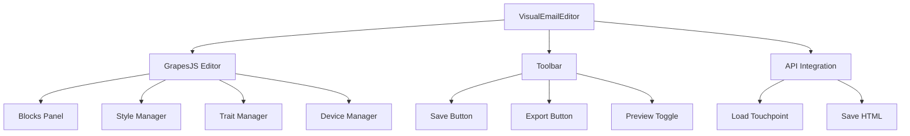

# WYSIWYG Visual Email Editor Plan

## Overview
Add a visual, drag-and-drop HTML email editor to the journey-visualizer app using **GrapesJS** - a free, open-source web builder framework that provides:
- WYSIWYG editing
- Drag-and-drop blocks
- Built-in email templates
- Export to raw HTML
- Style manager

---

## Implementation Steps

### Step 1: Add GrapesJS Dependency
**File:** [`apps/journey-visualizer/package.json`](apps/journey-visualizer/package.json)

Add `grapesjs` to dependencies:
```json
"grapesjs": "^0.21.9"
```

---

### Step 2: Create VisualEmailEditor Component
**New File:** [`apps/journey-visualizer/src/components/VisualEmailEditor.jsx`](apps/journey-visualizer/src/components/VisualEmailEditor.jsx)

Create a new component that:
- Initializes GrapesJS with email preset
- Loads existing HTML content from touchpoint
- Provides drag-and-drop blocks panel
- Includes style manager for colors/fonts
- Has export functionality (download HTML / copy to clipboard)

Key features:
- **Blocks Panel:** Pre-built email components (text, image, button, divider, columns, social, etc.)
- **Style Manager:** Edit colors, fonts, padding, margins visually
- **Trait Manager:** Edit element properties (links, src, etc.)
- **Export:** Download as .html file or copy to clipboard

---

### Step 3: Add CSS Styles
**New File:** [`apps/journey-visualizer/src/components/VisualEmailEditor.css`](apps/journey-visualizer/src/components/VisualEmailEditor.css)

Styles for:
- Editor container layout
- Custom panel styling to match app theme
- Toolbar buttons
- Export modal

---

### Step 4: Add Route to App
**File:** [`apps/journey-visualizer/src/App.jsx`](apps/journey-visualizer/src/App.jsx:350)

Add new route:
```jsx
<Route path="/touchpoints/:id/visual-edit" element={<VisualEmailEditor />} />
```

---

### Step 5: Update TouchpointList for New Editor Option
**File:** [`apps/journey-visualizer/src/components/TouchpointList.jsx`](apps/journey-visualizer/src/components/TouchpointList.jsx)

Add button/link to open visual editor alongside existing code editor option.

---

## Component Architecture



---

## GrapesJS Configuration

```javascript
const editor = grapesjs.init({
  container: '#gjs',
  height: '100%',
  width: '100%',
  storageManager: false,
  deviceManager: {
    devices: [
      { name: 'Desktop', width: '' },
      { name: 'Tablet', width: '768px', widthMedia: '992px' },
      { name: 'Mobile', width: '320px', widthMedia: '480px' }
    ]
  },
  panels: { defaults: [...] },
  blockManager: {
    appendTo: '#blocks',
    blocks: [
      // Email-specific blocks
      { label: 'Text', ... },
      { label: 'Image', ... },
      { label: 'Button', ... },
      { label: 'Divider', ... },
      { label: 'Columns', ... },
      { label: 'Social', ... },
      { label: 'Spacer', ... }
    ]
  },
  styleManager: { ... },
  traitManager: { ... },
  // Use email preset
  ...grapesjsPresetMail
});
```

---

## Export Functionality

1. **Download HTML:** Generate clean HTML file with inline styles
2. **Copy to Clipboard:** Quick copy for pasting elsewhere
3. **Save to Touchpoint:** Save back to database via API

```javascript
// Export HTML with inline styles
const exportHTML = () => {
  const html = editor.getHtml();
  const css = editor.getCss();
  const fullHTML = `
    <!DOCTYPE html>
    <html>
    <head>
      <style>${css}</style>
    </head>
    <body>${html}</body>
    </html>
  `;
  
  // Trigger download
  const blob = new Blob([fullHTML], { type: 'text/html' });
  const url = URL.createObjectURL(blob);
  // ... download logic
};
```

---

## Files to Create/Modify

| File | Action |
|------|--------|
| `apps/journey-visualizer/package.json` | Add grapesjs dependency |
| `apps/journey-visualizer/src/components/VisualEmailEditor.jsx` | Create new component |
| `apps/journey-visualizer/src/components/VisualEmailEditor.css` | Create styles |
| `apps/journey-visualizer/src/App.jsx` | Add route |
| `apps/journey-visualizer/src/components/TouchpointList.jsx` | Add link to visual editor |

---

## User Flow

1. User navigates to Touchpoints list
2. Clicks "Edit Visually" on any email touchpoint
3. Opens VisualEmailEditor with existing HTML loaded
4. Uses drag-and-drop to add/edit blocks
5. Uses style manager to customize appearance
6. Previews on desktop/tablet/mobile
7. Exports HTML or saves to touchpoint

---

## Next Steps After Approval

1. Switch to Code mode
2. Add grapesjs to package.json
3. Create VisualEmailEditor component with full GrapesJS integration
4. Add CSS styling
5. Add route in App.jsx
6. Test with existing touchpoint content
