# Sprint Execution Plan: 2026 Q1 Sprint 1

> **Master coordination document for all development work**  
> **Version:** 1.0  
> **Last Updated:** February 21, 2026  
> **Status:** ACTIVE

---

## 1. Sprint Overview

| Field | Value |
|-------|-------|
| **Sprint** | 2026 Q1 Sprint 1 |
| **Theme** | Foundational Stability |
| **Duration** | February 17 - March 2, 2026 (10 business days) |
| **Sprint Goal** | Stabilize core infrastructure and improve client onboarding |
| **Total Story Points** | 34 |
| **Completed Points** | 5 (15%) |
| **Remaining Points** | 29 (85%) |

### Sprint Progress

```
Completed:  ████████░░░░░░░░░░░░ 15%
Remaining:  ░░░░░░░░████████████░░ 85%
```

### Team Capacity

| Role | Assignee | Capacity | Notes |
|------|----------|----------|-------|
| Frontend Lead | @frontend-lead | 100% | Leading Journey Visualizer fixes |
| Frontend Dev | @frontend-dev | 100% | AI Assistant Panel focus |
| Backend Lead | @backend-lead | 100% | Sync & API work |
| Backend Dev | @backend-dev | 100% | CLI & validation tools |
| AI Specialist | @ai-specialist | 100% | Email Factory v2 AI |
| Product Lead | @product-lead | 75% | Documentation & coordination |

---

## 2. Task Execution Order & Dependencies

### Dependency Graph

```mermaid
graph TD
    BLOOM202[BLOOM-202<br/>AI Panel Memory Leak<br/>🟡 In Progress] -->|Unblocks| FRONTEND[Frontend Dev<br/>Continues]
    
    BLOOM205[BLOOM-205<br/>CLI Onboarding<br/>🟡 In Progress] -->|Blocks| BLOOM206[BLOOM-206<br/>Setup Validation<br/>🔴 Blocked]
    
    BLOOM203[BLOOM-203<br/>Sync Conflicts<br/>🔵 P0 - Ready] -->|Can start| IMMEDIATELY[Start Immediately]
    
    BLOOM204[BLOOM-204<br/>Email Factory v2 AI<br/>🟡 In Progress] -->|AI work| CONTINUES[Continues]
    
    BLOOM208[BLOOM-208<br/>GHL API Rate Limit<br/>🔵 P1 - Ready] -->|Independent| ANYTIME[Anytime]
    
    classDef inProgress fill:#fbbf24,stroke:#f59e0b,stroke-width:2px,color:#000
    classDef notStarted fill:#60a5fa,stroke:#3b82f6,stroke-width:2px,color:#000
    classDef blocked fill:#f87171,stroke:#ef4444,stroke-width:2px,color:#000
    
    class BLOOM202,BLOOM204,BLOOM205 inProgress
    class BLOOM203,BLOOM208 notStarted
    class BLOOM206 blocked
```



### Execution Sequence

| Phase | Days | Tasks | Priority |
|-------|------|-------|----------|
| **Phase 1** | Day 1-2 | BLOOM-203 (sync conflicts) | P0 |
| **Phase 2** | Day 2-4 | Complete BLOOM-202 (memory leak) | P0 |
| **Phase 3** | Day 3-5 | BLOOM-205 completion (CLI wizard) | P0 |
| **Phase 4** | Day 4-5 | BLOOM-206 (validation checks) | P0 |
| **Phase 5** | Day 5-6 | BLOOM-208 (rate limiting) | P1 |
| **Phase 6** | Day 7-10 | Buffer, testing, documentation | - |

---

## 3. Detailed Task Specifications

### BLOOM-202: Resolve AI Assistant Panel Memory Leak

| Field | Value |
|-------|-------|
| **Task ID** | BLOOM-202 |
| **Title** | Resolve AI Assistant Panel memory leak |
| **Priority** | P0 |
| **Story Points** | 8 |
| **Assignee** | @frontend-dev |
| **Status** | 🟡 In Progress |
| **Dependencies** | None |
| **Unblocks** | Frontend development continuity |

#### Acceptance Criteria

- [ ] Memory usage remains stable during extended AI panel sessions (>30 min)
- [ ] No memory growth detected in Chrome DevTools Memory tab
- [ ] All event listeners properly cleaned up on component unmount
- [ ] WebSocket connections closed when panel is closed
- [ ] React Query cache properly invalidated
- [ ] No detached DOM nodes retained in memory

#### Files to Modify

| File | Change Type | Description |
|------|-------------|-------------|
| `apps/journey-visualizer/src/components/AIAssistantPanel.jsx` | Modify | Add cleanup in useEffect return |
| `apps/journey-visualizer/src/components/AIAssistantPanel.css` | Modify | Review for potential leaks |
| `apps/journey-visualizer/src/services/apiClient.js` | Modify | Add request cancellation |
| `apps/journey-visualizer/src/hooks/useJourneys.js` | Modify | Add proper cache cleanup |

#### Testing Requirements

- [ ] **Memory Profiling:** Use Chrome DevTools Performance monitor for 30-min session
- [ ] **Regression Test:** Verify AI chat functionality still works
- [ ] **Browser Testing:** Chrome, Safari, Firefox
- [ ] **Load Test:** Open/close panel 50x, verify no memory accumulation

---

### BLOOM-203: Fix Sync Conflicts on Simultaneous Edits

| Field | Value |
|-------|-------|
| **Task ID** | BLOOM-203 |
| **Title** | Fix sync conflicts on simultaneous edits |
| **Priority** | P0 |
| **Story Points** | 5 |
| **Assignee** | @backend-lead |
| **Status** | 🔵 Not Started |
| **Dependencies** | None |
| **Unblocks** | Multi-user collaboration stability |

#### Acceptance Criteria

- [ ] Conflicts detected within 500ms of simultaneous edit
- [ ] Last-write-wins with conflict notification to users
- [ ] Version vector implemented for optimistic locking
- [ ] Automatic merge for non-conflicting changes
- [ ] User notified with clear conflict resolution UI
- [ ] No data loss in conflict scenarios

#### Files to Modify

| File | Change Type | Description |
|------|-------------|-------------|
| `apps/journey-api/src/routes/journeys.js` | Modify | Add version check middleware |
| `apps/journey-api/prisma/schema.prisma` | Modify | Add version/timestamp fields |
| `scripts/sync-engine/src/services/sync.js` | Modify | Implement conflict detection |
| `apps/journey-visualizer/src/services/dataService.js` | Modify | Handle conflict responses |

#### Testing Requirements

- [ ] **Unit Test:** Conflict detection algorithm (100% coverage)
- [ ] **Integration Test:** Two concurrent edits, verify resolution
- [ ] **E2E Test:** Cypress test with two browser sessions
- [ ] **Stress Test:** 10 simultaneous edits, verify data integrity
- [ ] **Regression Test:** Single-user editing still works normally

---

### BLOOM-204: Implement Email Factory v2 AI Validation

| Field | Value |
|-------|-------|
| **Task ID** | BLOOM-204 |
| **Title** | Implement Email Factory v2 AI validation |
| **Priority** | P0 |
| **Story Points** | 5 |
| **Assignee** | @ai-specialist |
| **Status** | 🟡 In Progress |
| **Dependencies** | None |
| **Unblocks** | BLOOM-207 (documentation) |

#### Acceptance Criteria

- [ ] AI validates template syntax against GHL schema
- [ ] Brand voice accuracy scoring achieves 90%+ match
- [ ] Validation catches 100% of MJML syntax errors
- [ ] Invalid templates blocked from deployment
- [ ] Validation report generated for each template
- [ ] Fallback to manual review for edge cases

#### Files to Modify

| File | Change Type | Description |
|------|-------------|-------------|
| `scripts/sync-engine/src/services/ai-validation.js` | Create | New AI validation service |
| `scripts/sync-engine/src/services/brand-voice-analyzer.js` | Modify | Enhance accuracy scoring |
| `clients/cameron-estate/email-factory/src/build.js` | Modify | Integrate validation step |
| `clients/cameron-estate/email-factory/src/utils/content-compliance.js` | Modify | Add AI validation calls |

#### Testing Requirements

- [ ] **Unit Test:** Validation service with 50+ test templates
- [ ] **Accuracy Test:** Brand voice scoring benchmark
- [ ] **Integration Test:** Full build pipeline with validation
- [ ] **Performance Test:** Validation completes in <5s per template
- [ ] **Edge Case Test:** Malformed inputs, empty templates

---

### BLOOM-205: Create CLI Onboarding Wizard Improvements

| Field | Value |
|-------|-------|
| **Task ID** | BLOOM-205 |
| **Title** | Create CLI onboarding wizard improvements |
| **Priority** | P0 |
| **Story Points** | 8 |
| **Assignee** | @backend-dev |
| **Status** | 🟡 In Progress |
| **Dependencies** | None |
| **Blocks** | BLOOM-206 |

#### Acceptance Criteria

- [ ] Wizard completes full setup in under 15 minutes
- [ ] Interactive prompts guide user through each step
- [ ] Progress bar shows completion percentage
- [ ] Configuration validated at each step
- [ ] Resume capability for interrupted setups
- [ ] Rollback command for failed setups
- [ ] Detailed logging for troubleshooting

#### Files to Modify

| File | Change Type | Description |
|------|-------------|-------------|
| `scripts/setup-airtable-v2.js` | Modify | Enhance with interactive prompts |
| `scripts/setup-airtable.js` | Modify | Add wizard mode |
| `scripts/sync-engine/scripts/setup-ai.js` | Modify | Integrate into wizard |
| `docs/ONBOARDING_GUIDE.md` | Modify | Update with new wizard usage |

#### Testing Requirements

- [ ] **E2E Test:** Full setup from scratch (fresh environment)
- [ ] **Resume Test:** Interrupt and resume wizard
- [ ] **Rollback Test:** Verify cleanup after failed setup
- [ ] **User Test:** Non-technical team member completes setup
- [ ] **Performance Test:** Complete run under 15 minutes

---

### BLOOM-206: Add Automated Setup Validation Checks

| Field | Value |
|-------|-------|
| **Task ID** | BLOOM-206 |
| **Title** | Add automated setup validation checks |
| **Priority** | P0 |
| **Story Points** | 3 |
| **Assignee** | @backend-dev |
| **Status** | 🔴 Blocked |
| **Dependencies** | BLOOM-205 |
| **Blocked Reason** | Requires CLI wizard completion |

#### Acceptance Criteria

- [ ] Validates API credentials are correct
- [ ] Checks required environment variables present
- [ ] Verifies database connectivity
- [ ] Tests GHL API access permissions
- [ ] Validates Airtable base structure
- [ ] Generates validation report with fix suggestions
- [ ] 95% of configuration errors caught automatically

#### Files to Modify

| File | Change Type | Description |
|------|-------------|-------------|
| `scripts/sync-engine/src/services/ghl.js` | Modify | Add validation methods |
| `scripts/setup-airtable-v2.js` | Modify | Add validation step |
| `scripts/sync-engine/src/services/database.js` | Modify | Add connectivity checks |
| `clients/maison-albion/setup-validation-report.json` | Reference | Example validation output |

#### Testing Requirements

- [ ] **Unit Test:** Each validation check independently
- [ ] **Integration Test:** Full validation suite
- [ ] **Negative Test:** Invalid configs detected properly
- [ ] **Report Test:** Verify JSON report format

---

### BLOOM-208: Implement GHL API Rate Limiting Backoff

| Field | Value |
|-------|-------|
| **Task ID** | BLOOM-208 |
| **Title** | Implement GHL API rate limiting backoff |
| **Priority** | P1 |
| **Story Points** | 3 |
| **Assignee** | @backend-lead |
| **Status** | 🔵 Not Started |
| **Dependencies** | None |

#### Acceptance Criteria

- [ ] Exponential backoff implemented (1s, 2s, 4s, 8s, max 60s)
- [ ] Rate limit headers parsed from GHL responses
- [ ] Queue system for requests when rate limited
- [ ] Retry count logged for monitoring
- [ ] Fallback behavior when max retries exceeded
- [ ] No data loss during rate limit periods

#### Files to Modify

| File | Change Type | Description |
|------|-------------|-------------|
| `scripts/sync-engine/src/services/ghl.js` | Modify | Add retry logic |
| `scripts/sync-engine/src/services/sync.js` | Modify | Queue management |
| `apps/journey-api/src/middleware/error-handler.js` | Modify | Handle 429 responses |

#### Testing Requirements

- [ ] **Unit Test:** Backoff calculation logic
- [ ] **Mock Test:** Simulate 429 responses
- [ ] **Integration Test:** Actual rate limit handling
- [ ] **Load Test:** High volume requests, verify queuing

---

## 4. Daily Execution Schedule

### Week 1: February 17-21, 2026

| Day | Date | Primary Focus | Secondary Tasks | Owner | Deliverable |
|-----|------|---------------|-----------------|-------|-------------|
| **Day 1** | Feb 17 | BLOOM-203 kickoff | BLOOM-202 continues | @backend-lead | Conflict detection design doc |
| **Day 2** | Feb 18 | BLOOM-203 implementation | BLOOM-202 profiling | @backend-lead | Sync conflict algorithm |
| **Day 2-4** | Feb 18-20 | **BLOOM-202 completion** | - | @frontend-dev | Memory leak fixed, PR open |
| **Day 3-5** | Feb 19-21 | **BLOOM-205 completion** | BLOOM-204 continues | @backend-dev | CLI wizard complete |
| **Day 4-5** | Feb 20-21 | **BLOOM-206 start** | BLOOM-203 testing | @backend-dev | Validation checks framework |

### Week 2: February 24-28, 2026

| Day | Date | Primary Focus | Secondary Tasks | Owner | Deliverable |
|-----|------|---------------|-----------------|-------|-------------|
| **Day 5-6** | Feb 24-25 | **BLOOM-208** | BLOOM-206 completion | @backend-lead | Rate limiting implemented |
| **Day 6-7** | Feb 25-26 | BLOOM-204 completion | Testing | @ai-specialist | AI validation v2 |
| **Day 8** | Feb 27 | Integration testing | Bug fixes | All | Test reports |
| **Day 9** | Feb 28 | **Client demo prep** | Documentation | @product-lead | Demo ready |
| **Day 10** | Mar 2 | Sprint review | Retro planning | All | Sprint complete |

### Gantt Timeline

```
Week 1: Feb 17-21                    Week 2: Feb 24-Mar 2
| Mon | Tue | Wed | Thu | Fri |     | Mon | Tue | Wed | Thu | Fri |
|-----|-----|-----|-----|-----|     |-----|-----|-----|-----|-----|
| 203 | 203 |     |     |     |     |     |     |     |     |     |
|     | 202 | 202 | 202 |     |     |     |     |     |     |     |
|     |     | 205 | 205 | 205 |     |     |     |     |     |     |
|     |     |     | 206 | 206 |     |     |     |     |     |     |
|     |     |     |     |     |     | 208 | 208 |     |     |     |
|     |     | 204 | 204 | 204 |     |     | 204 |     |     |     |
|     |     |     |     |     |     |     |     | TEST| DEMO|DONE |
```

---

## 5. Risk Mitigation

### Risk Register

| Risk | Impact | Likelihood | Mitigation Strategy | Owner |
|------|--------|------------|---------------------|-------|
| **Data corruption from sync conflicts** | Critical | Medium | - Implement transaction rollback<br>- Daily automated backups<br>- Conflict audit log<br>- Staged rollout with feature flag | @backend-lead |
| **Memory leak affecting production uptime** | High | Medium | - Profile in staging first<br>- Canary deployment<br>- Rollback plan ready<br>- Monitoring alerts for memory usage | @frontend-dev |
| **API rate limiting causing sync delays** | Medium | High | - Exponential backoff implementation<br>- Request queue with priority<br>- Fallback to cached data<br>- Monitor rate limit headers | @backend-lead |
| **AI provider downtime** | Medium | Low | - Cached template fallback<br>- Manual review workflow<br>- Multiple provider support (future) | @ai-specialist |
| **Team member availability** | Medium | Medium | - Cross-training on critical tasks<br>- Documented runbooks<br>- Paired programming sessions | @product-lead |

### Contingency Plans

#### If BLOOM-202 (Memory Leak) Takes Longer Than Expected

1. **Day 3 Check:** If root cause not identified, escalate to @tech-lead
2. **Day 4 Decision:** Consider hotfix release with temporary workaround
3. **Fallback:** Reduce AI panel session timeout as temporary mitigation

#### If BLOOM-205 (CLI Wizard) Blocks BLOOM-206

1. **Parallel Track:** Start BLOOM-206 validation framework design
2. **Scope Reduction:** Reduce wizard features to unblock validation
3. **Split Work:** Assign BLOOM-206 to different developer

#### If GHL API Rate Limits Block Testing

1. **Mock Server:** Use recorded API responses for testing
2. **Off-Hours Testing:** Schedule heavy testing during low-traffic periods
3. **Staging Environment:** Use dedicated staging GHL account

---

## 6. Definition of Done Reference

All tasks in this sprint must satisfy the [Definition of Done](../../docs/team/definition-of-done.md).

### Universal DoD Checklist

#### Functional Requirements
- [ ] Requirement Met - The implementation satisfies the acceptance criteria
- [ ] No Regressions - Existing functionality continues to work
- [ ] Edge Cases Handled - Boundary conditions and error scenarios addressed
- [ ] Feature Toggle - New features use feature flags where appropriate

#### Code Quality
- [ ] Code Review Approved - At least one team member has reviewed
- [ ] Follows Style Guide - ESLint/Prettier compliance
- [ ] Self-Reviewed - Author reviewed before requesting review
- [ ] No TODOs/FIXMEs - No temporary comments in production code

#### Testing
- [ ] Unit Tests - 80%+ coverage for new code
- [ ] Integration Tests - API endpoints tested
- [ ] Tests Passing - All tests pass locally and in CI
- [ ] Manual Testing - Feature tested in realistic environment

#### Documentation
- [ ] Code Comments - Complex logic explained
- [ ] README Updated - Setup/usage changes documented
- [ ] Changelog Updated - Significant changes in [CHANGELOG.md](../../CHANGELOG.md)

#### Security
- [ ] Input Validation - All user inputs validated
- [ ] No Secrets in Code - API keys not committed
- [ ] SQL Injection Safe - Parameterized queries used

### Sprint-Specific DoD Additions

- [ ] Safari, Chrome, Firefox compatibility verified
- [ ] Email templates validated against GHL API schema
- [ ] Onboarding flow tested by non-technical team member
- [ ] Performance benchmarks show no regression

---

## 7. Communication Plan

### Daily Standups

| Detail | Information |
|--------|-------------|
| **Time** | 9:30 AM ET |
| **Duration** | 15 minutes |
| **Format** | Async in #sprint-2026-q1-s1 channel |
| **Required** | All developers |
| **Optional** | Product lead, QA |

#### Standup Template

```
**Yesterday:**
- Completed: [task]
- Blockers: [none/task/issue]

**Today:**
- Working on: [task]
- Need help with: [none/topic]
- ETA for current task: [date]
```

### Slack Channel Updates

| Channel | Purpose | Update Frequency |
|---------|---------|------------------|
| `#sprint-2026-q1-s1` | Daily progress, blockers | Daily |
| `#dev-frontend` | Frontend-specific updates | As needed |
| `#dev-backend` | Backend/API updates | As needed |
| `#deployments` | Deployment notifications | Per deployment |
| `#incidents` | Production issues | Immediate |

### PR Review Assignments

| Task | Author | Reviewer | Expected Review Time |
|------|--------|----------|----------------------|
| BLOOM-202 | @frontend-dev | @frontend-lead | 4 hours |
| BLOOM-203 | @backend-lead | @backend-dev | 4 hours |
| BLOOM-204 | @ai-specialist | @tech-lead | 6 hours |
| BLOOM-205 | @backend-dev | @backend-lead | 4 hours |
| BLOOM-206 | @backend-dev | @backend-lead | 2 hours |
| BLOOM-208 | @backend-lead | @tech-lead | 2 hours |

### Escalation Path

```
Issue Identified
       ↓
Try team Slack channel (#sprint-2026-q1-s1)
       ↓
No resolution in 2 hours
       ↓
Ping @tech-lead directly
       ↓
Still blocked after 4 hours
       ↓
Escalate to sprint planning meeting / emergency sync
```

### Sprint Ceremonies

| Ceremony | Date | Time | Attendees |
|----------|------|------|-----------|
| **Mid-Sprint Review** | Feb 24 | 2:00 PM ET | All team |
| **Client Demo Prep** | Feb 27 | 10:00 AM ET | @product-lead, @frontend-lead |
| **Sprint Review** | Mar 2 | 2:00 PM ET | All team + stakeholders |
| **Retrospective** | Mar 2 | 3:00 PM ET | All team |

---

## 8. Quick Reference

### Important Links

| Resource | Link |
|----------|------|
| Sprint Backlog | [backlog.md](./backlog.md) |
| Sprint Goals | [goals.md](./goals.md) |
| Definition of Done | [docs/team/definition-of-done.md](../../docs/team/definition-of-done.md) |
| Code Review Guide | [docs/team/code-review-guide.md](../../docs/team/code-review-guide.md) |
| Project Handbook | [docs/PROJECT_HANDBOOK.md](../../docs/PROJECT_HANDBOOK.md) |
| Onboarding Guide | [docs/ONBOARDING_GUIDE.md](../../docs/ONBOARDING_GUIDE.md) |

### Key Contacts

| Role | Handle | Responsibility |
|------|--------|----------------|
| Tech Lead | @tech-lead | Technical decisions, escalations |
| Product Lead | @product-lead | Requirements, client communication |
| Frontend Lead | @frontend-lead | UI/UX decisions, frontend PRs |
| Backend Lead | @backend-lead | API design, backend PRs |
| QA Lead | @qa-lead | Testing strategy, sign-off |

### Emergency Procedures

**Production Issue During Sprint:**
1. Create hotfix branch from `main`
2. Fix the issue
3. Fast-track review (ping reviewers directly)
4. Deploy via emergency pipeline
5. Retroactively create ticket for tracking

**Scope Change Request:**
1. Discuss in #sprint-2026-q1-s1
2. Product lead approves/rejects
3. If approved, mark equivalent points as deferred
4. Update this execution plan

---

## 9. Appendix

### Story Point Reference

| Points | Relative Size | Time Estimate |
|--------|---------------|---------------|
| 1 | Trivial | < 2 hours |
| 2 | Small | Half day |
| 3 | Medium | 1 day |
| 5 | Large | 2-3 days |
| 8 | Extra Large | 1 week |
| 13 | Epic | 1-2 sprints |

### Status Legend

| Icon | Status | Description |
|------|--------|-------------|
| 🔵 | Not Started | Ready to begin |
| 🟡 | In Progress | Actively being worked |
| 🟠 | In Review | PR open, awaiting review |
| 🟢 | Done | Merged and deployed |
| 🔴 | Blocked | Cannot proceed (see dependencies) |

### Change Log

| Date | Version | Changes | Author |
|------|---------|---------|--------|
| 2026-02-21 | 1.0 | Initial execution plan created | Architect |

---

**Document Owner:** @product-lead  
**Last Updated:** February 21, 2026  
**Next Review:** Daily standup

> 💡 **Tip:** This document is a living reference. Update it as the sprint progresses to reflect actual status, blockers, and changes.
